# TaskFlow

A production grade Kanban board application built with FastAPI, React and PostgreSQL.
Features drag and drop card management, LexoRank ordering, optimistic UI updates with rollback and concurrency safe card moves via row level locking.

---

## Table of Contents

1. [Quick Start](#quick-start)
2. [System Architecture](#system-architecture)
3. [Tech Stack](#tech-stack)
4. [Project Structure](#project-structure)
5. [File-by-File Breakdown](#file-by-file-breakdown)
6. [Database Schema](#database-schema)
7. [API Endpoints](#api-endpoints)
8. [Code Flow: Full Request Lifecycle](#code-flow-full-request-lifecycle)
9. [Ordering Algorithm: LexoRank](#ordering-algorithm-lexorank)
10. [Race Condition Handling](#race-condition-handling)
11. [Optimistic UI and Rollback](#optimistic-ui-and-rollback)
12. [N+1 Query Prevention](#n1-query-prevention)
13. [Soft Delete Cascade](#soft-delete-cascade)
14. [Authentication Flow](#authentication-flow)
15. [Frontend State Management](#frontend-state-management)
16. [Drag-and-Drop Architecture](#drag-and-drop-architecture)
17. [Docker Infrastructure](#docker-infrastructure)
18. [Testing](#testing)
19. [Development Setup](#development-setup)
20. [Environment Variables](#environment-variables)
21. [Design Decisions Summary](#design-decisions-summary)

---

## Quick Start

```bash
docker compose up --build
```

| Service     | URL                          |
|-------------|------------------------------|
| Frontend    | http://localhost:5173         |
| Backend API | http://localhost:8000         |
| API Docs    | http://localhost:8000/docs    |
| Health      | http://localhost:8000/health  |

---

## System Architecture

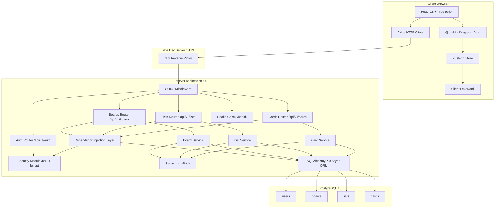

---

## Tech Stack

### Backend

| Technology             | Purpose                                              |
|------------------------|------------------------------------------------------|
| FastAPI 0.111          | Async Python web framework with auto OpenAPI docs    |
| SQLAlchemy 2.0         | Async ORM with `selectinload` for N+1 prevention    |
| PostgreSQL 15          | Primary database with UUID PKs and row-level locks   |
| Alembic 1.13           | Database schema migrations                           |
| python-jose            | JWT token creation and validation                    |
| bcrypt 5.0             | Password hashing (used directly, not via passlib)    |
| Pydantic V2            | Request/response validation with `from_attributes`   |
| asyncpg                | Async PostgreSQL driver                              |
| aiosqlite              | Async SQLite driver for local dev and tests          |

### Frontend

| Technology             | Purpose                                              |
|------------------------|------------------------------------------------------|
| React 18               | Component-based UI with TypeScript strict mode       |
| @dnd-kit               | Accessible drag-and-drop with SortableContext        |
| Zustand 4.5            | Lightweight global state with optimistic updates     |
| TanStack Query 5       | Server state management (QueryClientProvider)        |
| Axios 1.6              | HTTP client with request/response interceptors       |
| Tailwind CSS 3.4       | Utility-first styling with custom brand palette      |
| Lucide React           | SVG icon library                                     |
| Vite 5.2               | Build tool and dev server with HMR and API proxy     |

### Infrastructure

| Technology             | Purpose                                              |
|------------------------|------------------------------------------------------|
| Docker Compose         | 3-service orchestration (db, backend, frontend)      |
| PostgreSQL Alpine      | Lightweight database container with healthcheck      |
| Volume Mounts          | Hot reload for both backend and frontend in dev      |

---


## Database Schema

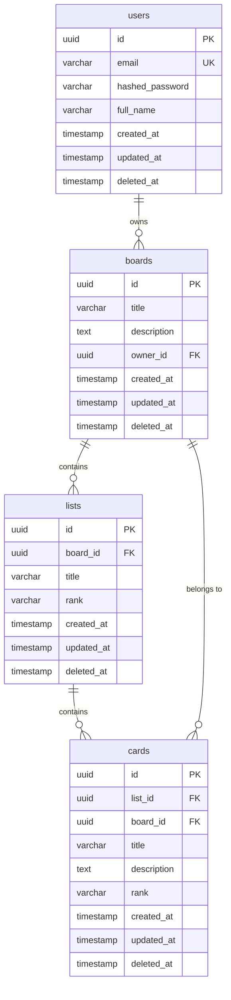

Unique constraints: `(board_id, rank)` on `lists`, `(list_id, rank)` on `cards`. All tables include `deleted_at` for soft deletes. All primary keys are UUID v4.

---

## API Endpoints

| Method | Endpoint                    | Description                          | Auth Required |
|--------|-----------------------------|--------------------------------------|---------------|
| POST   | `/api/v1/auth/register`     | Register new user                    | No            |
| POST   | `/api/v1/auth/login`        | Login, returns JWT                   | No            |
| GET    | `/api/v1/boards`            | List current user's boards           | Yes           |
| POST   | `/api/v1/boards`            | Create board + default "To Do" list  | Yes           |
| GET    | `/api/v1/boards/{id}`       | Board detail with lists and cards    | Yes           |
| PATCH  | `/api/v1/boards/{id}`       | Update board title/description       | Yes           |
| DELETE | `/api/v1/boards/{id}`       | Soft delete cascade (board+lists+cards) | Yes        |
| POST   | `/api/v1/lists`             | Create list with LexoRank position   | Yes           |
| PATCH  | `/api/v1/lists/{id}`        | Update list title                    | Yes           |
| DELETE | `/api/v1/lists/{id}`        | Soft delete list and its cards       | Yes           |
| POST   | `/api/v1/cards`             | Create card at end of list           | Yes           |
| PATCH  | `/api/v1/cards/{id}`        | Update card title/description        | Yes           |
| POST   | `/api/v1/cards/{id}/move`   | Move card with FOR UPDATE lock       | Yes           |
| DELETE | `/api/v1/cards/{id}`        | Soft delete card                     | Yes           |

---

## Code Flow: Full Request Lifecycle

### Card Move -- End to End

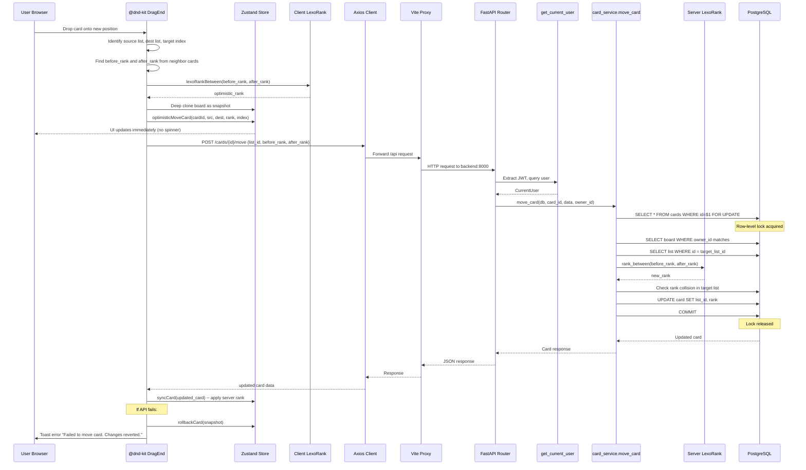

### Board Detail Fetch

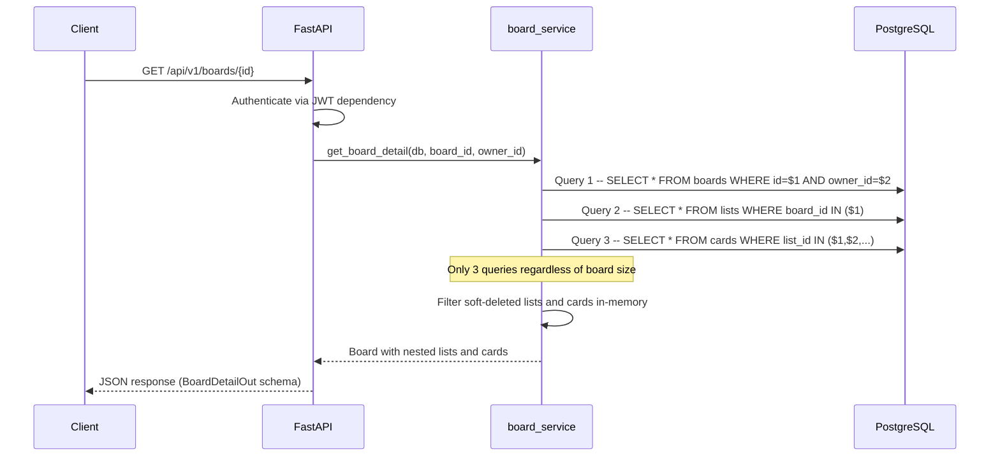

---

## Ordering Algorithm: LexoRank

### Why LexoRank Was Chosen Over Integer Indices

The fundamental problem with integer-based ordering is that repositioning a single item requires updating multiple rows. Consider a list of 100 cards ordered by an integer `position` column:

- Moving card from position 1 to position 50 requires: `UPDATE cards SET position = position - 1 WHERE position BETWEEN 2 AND 50`
- That is 49 rows touched for a single drag operation
- With concurrent users, this creates widespread lock contention

LexoRank solves this by using **base-36 string comparison** for ordering. Moving a card requires updating **exactly one row** -- the moved card itself. The new rank is computed as the lexicographic midpoint between its two neighbors.

### How LexoRank Works

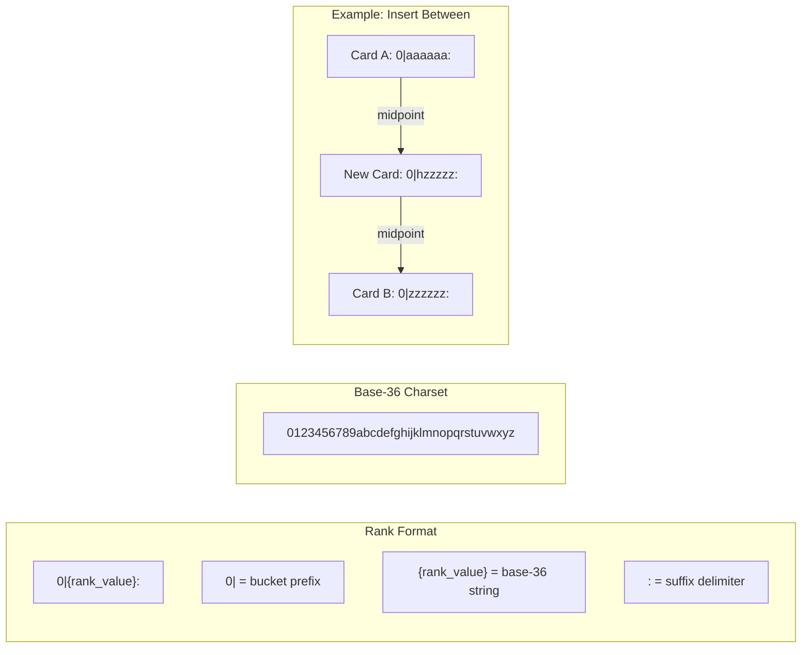

**Algorithm steps:**

1. **Parse**: Strip the `0|` prefix and `:` suffix to get the raw rank value
2. **Decode**: Convert the base-36 string to an integer
3. **Midpoint**: Compute `(before_int + after_int) / 2`
4. **Encode**: Convert the integer back to a base-36 string, zero-padded
5. **Format**: Wrap with `0|` prefix and `:` suffix

**Edge cases handled:**

- **Insert at start** (before = null): Halve the `after` rank's integer value
- **Insert at end** (after = null): Compute 3/4 of the way between `before` and the maximum possible value
- **Ranks too close**: When the midpoint equals either neighbor, extend the string by appending `"i"` (middle of alphabet)
- **Rank collision detection**: The server checks if the computed rank already exists in the target list and appends `"i"` if so
- **Database enforcement**: A unique constraint on `(list_id, rank)` prevents duplicate ranks at the database level

**Why the client also implements LexoRank:**

The frontend mirrors the backend algorithm in `src/utils/lexorank.ts` so that optimistic UI updates can compute a plausible rank immediately, before the server responds. The server's computed rank (which may differ due to concurrent activity) replaces the optimistic rank on API success via `syncCard`.

---

## Race Condition Handling

### The Problem

Two users (A and B) both drag Card X at the same time. Without protection:

1. Both read Card X's current state (list_id = L1, rank = "0|hzzzzz:")
2. Both compute new ranks based on the same stale neighbor information
3. Both write their updates -- one overwrites the other
4. The card ends up in the wrong position, or two cards share the same rank

### The Solution: SELECT FOR UPDATE

The `move_card` function in `card_service.py` uses PostgreSQL's row-level locking:

```sql
SELECT * FROM cards WHERE id = $1 FOR UPDATE
```

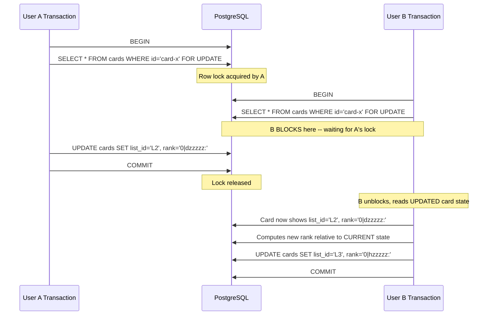

**Why SELECT FOR UPDATE over optimistic locking (version counters):**

- Card moves are infrequent relative to reads
- Lock hold time is minimal (under 5ms for typical moves)
- No retry logic needed on the client -- the second transaction simply waits
- Version counter approaches would require the client to detect conflicts and retry, adding complexity
- `FOR UPDATE` guarantees serialized execution for the same card without affecting other cards

**SQLite compatibility:**

SQLite does not support `FOR UPDATE`. The code detects the database dialect at runtime and skips the locking clause when running on SQLite (used in tests and local development). This is acceptable because SQLite serializes all writes at the database level anyway.

---

## Optimistic UI and Rollback

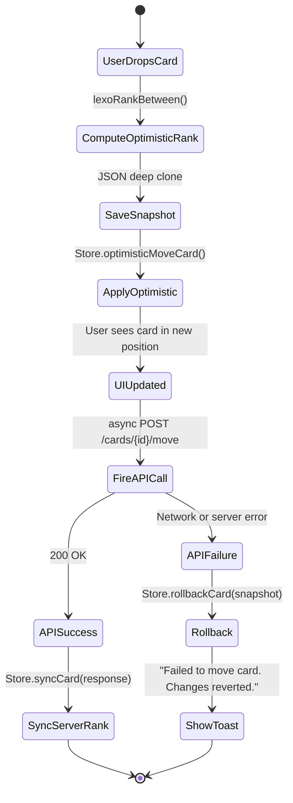

The optimistic update strategy ensures the UI feels instant. The board state is deep-cloned before mutation so that any failure can restore the exact previous state. The server-computed rank replaces the client-computed rank on success to account for any differences (such as collision resolution or concurrent modifications).

---

## N+1 Query Prevention

The `get_board_detail` function uses SQLAlchemy's `selectinload` strategy:

```python
select(Board)
    .options(selectinload(Board.lists).selectinload(List.cards))
```

This generates exactly **3 SQL queries** regardless of how many lists or cards exist:

| Query | SQL | Result |
|-------|-----|--------|
| 1 | `SELECT * FROM boards WHERE id = $1 AND owner_id = $2` | 1 board |
| 2 | `SELECT * FROM lists WHERE board_id IN ($1)` | N lists |
| 3 | `SELECT * FROM cards WHERE list_id IN ($1, $2, ...)` | All cards |

Without `selectinload`, accessing `board.lists[0].cards` would trigger a lazy load query per list, resulting in 1 + N + (N * M) queries for a board with N lists and M cards per list.

---

## Soft Delete Cascade

All entities use `deleted_at` timestamps instead of `DELETE FROM`. The cascade flow:

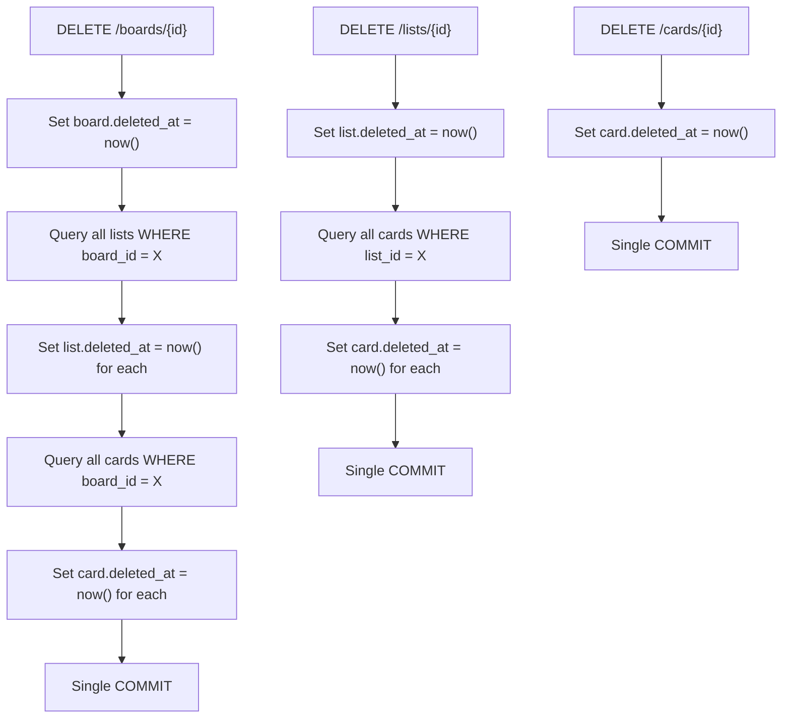

All read queries include `WHERE deleted_at IS NULL` to exclude soft-deleted records. Data remains in the database for auditing and potential recovery.

---

## Authentication Flow

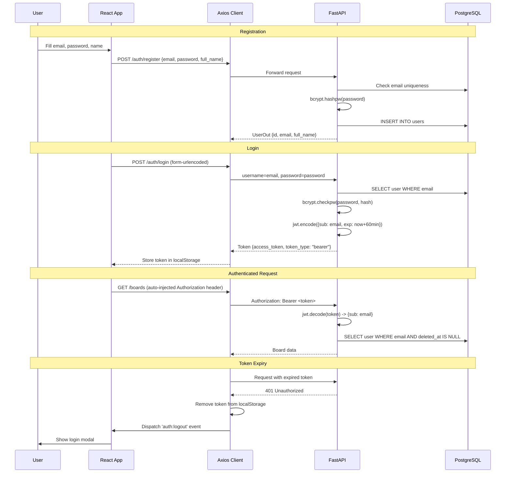

---

## Frontend State Management

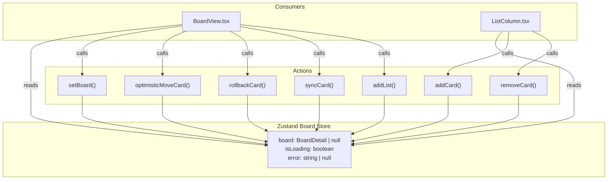

All store mutations create deep clones via `JSON.parse(JSON.stringify(...))` to ensure immutability. Lists and cards are re-sorted by rank after every mutation.

---

## Drag-and-Drop Architecture

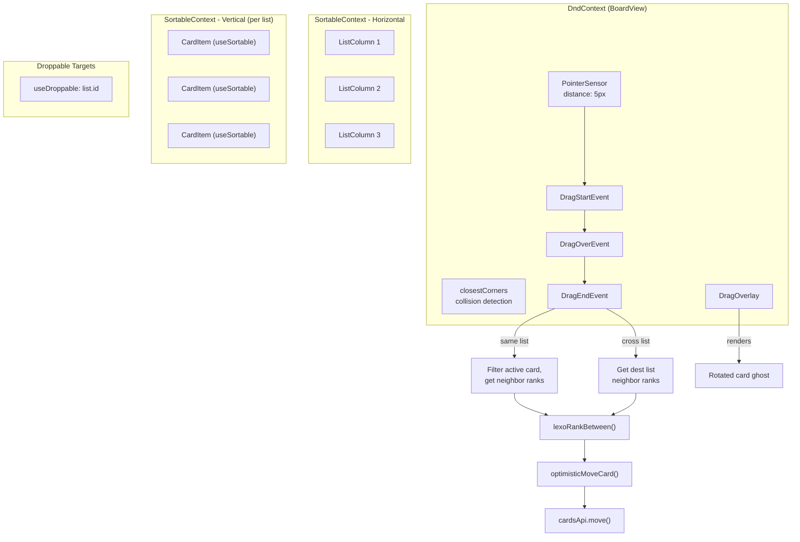

---

## Docker Infrastructure

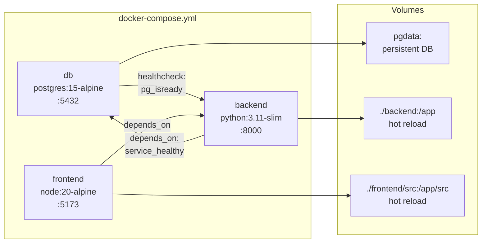

The backend container runs `alembic upgrade head` before starting uvicorn. The frontend Vite dev server proxies `/api` requests to the backend container using `VITE_PROXY_TARGET`.

---

## Testing

```bash
cd backend
pip install -r requirements.txt
pytest app/tests/ -v --tb=short

# With coverage
pytest app/tests/ --cov=app --cov-report=term-missing
```

| Test File | Tests | Coverage Area |
|-----------|-------|---------------|
| `test_auth.py` | 5 | Registration, login, validation, auth guards |
| `test_boards.py` | 5 | CRUD, soft delete, cross-user isolation |
| `test_cards.py` | 5 | CRUD, cross-list move, LexoRank format, soft delete |
| `test_lexorank.py` | 6 | Algorithm correctness, ordering, collision resistance |

Tests use SQLite via `aiosqlite` with per-test table creation/teardown for full isolation. The `conftest.py` overrides FastAPI's `get_db` dependency to use the test database.

---

## Development Setup

### Local Development (without Docker)

**Backend:**
```bash
cd backend
python -m venv venv
venv\Scripts\activate        # Windows
# source venv/bin/activate   # macOS/Linux
pip install -r requirements.txt
uvicorn app.main:app --reload
```

**Frontend:**
```bash
cd frontend
npm install
npm run dev
```

The Vite dev server proxies `/api` requests to `http://localhost:8000` by default. No `VITE_API_URL` configuration is needed for local development.

### With Docker

```bash
docker compose up --build
```

All services start with hot reload enabled via volume mounts.

---

## Environment Variables

| Variable                      | Default                                  | Required | Description                    |
|-------------------------------|------------------------------------------|----------|--------------------------------|
| `DATABASE_URL`                | `sqlite+aiosqlite:///./taskflow.db`      | No       | Database connection string     |
| `SECRET_KEY`                  | `supersecretkey123changeinprod`           | Yes (prod) | JWT signing secret           |
| `ALGORITHM`                   | `HS256`                                  | No       | JWT algorithm                  |
| `ACCESS_TOKEN_EXPIRE_MINUTES` | `60`                                     | No       | Token time-to-live in minutes  |
| `VITE_API_URL`                | `/api/v1`                                | No       | Frontend API base URL          |
| `VITE_PROXY_TARGET`           | `http://localhost:8000`                  | No       | Vite proxy target (Docker)     |
| `TEST_DATABASE_URL`           | Not set                                  | No       | Override DB URL for tests      |

---

## Design Decisions Summary

| Decision | Choice | Rationale |
|----------|--------|-----------|
| Ordering algorithm | LexoRank (base-36 strings) | Single-row updates on move; O(1) instead of O(n) |
| Concurrency control | `SELECT ... FOR UPDATE` | Serializes concurrent moves on the same card with minimal lock time |
| Query optimization | `selectinload` chain | Exactly 3 queries for any board size; prevents N+1 |
| Deletion strategy | Soft delete with `deleted_at` | Data recovery, audit trail, single-transaction cascades |
| UI responsiveness | Optimistic updates + rollback | Instant drag-and-drop feel; snapshot-based rollback on failure |
| Client LexoRank | Mirrored implementation | Enables optimistic rank computation without server round-trip |
| Authentication | Stateless JWT + bcrypt | No server-side session storage; secure password hashing |
| State management | Zustand | Minimal boilerplate; immutable deep clones for safety |
| Drag-and-drop | @dnd-kit | Accessible, composable, supports nested sortable contexts |
| TypeScript | Strict mode, zero `any` | Catches errors at compile time; self-documenting interfaces |
| Database | PostgreSQL + UUID PKs | Native UUID support, `FOR UPDATE` locking, robust indexing |
| Dev/test DB | SQLite via aiosqlite | Zero-config local development; per-test isolation |
